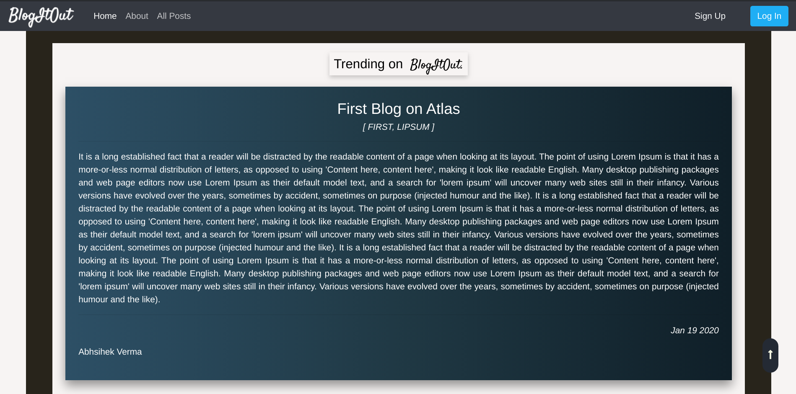
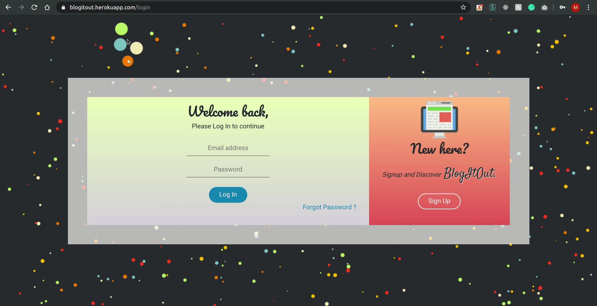
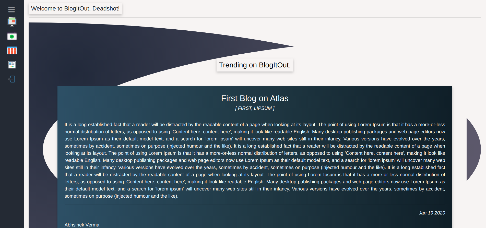
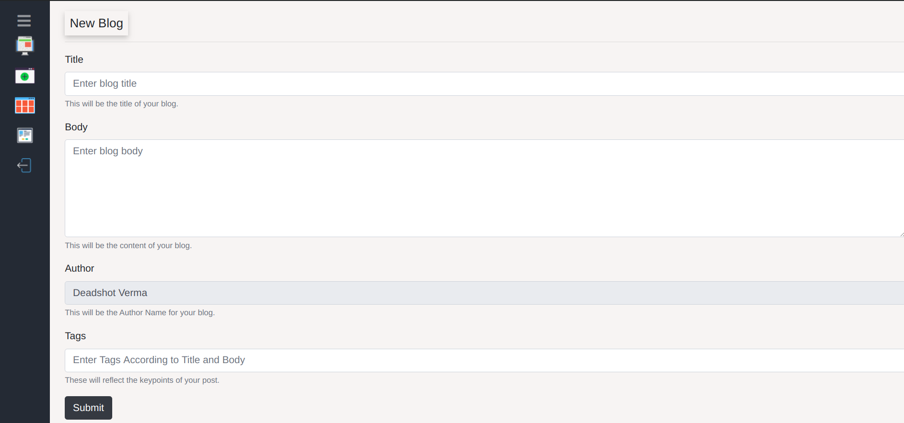
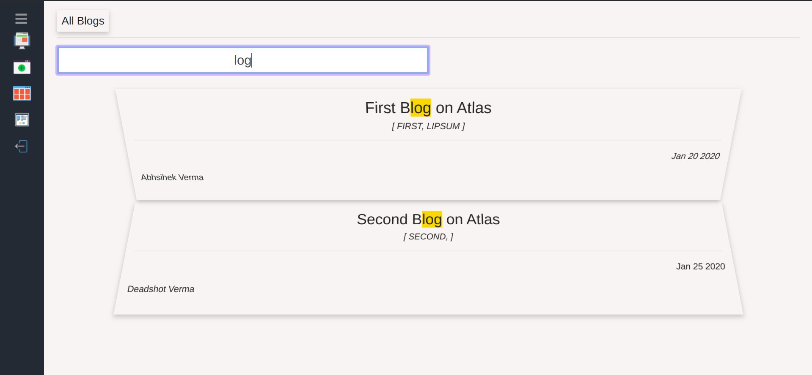
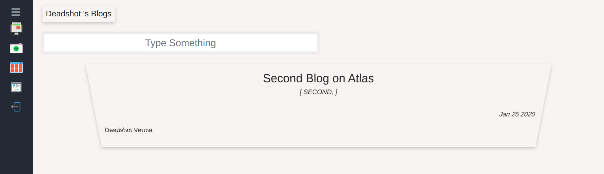

<h1 align="center">BlogItOut</h1>
<h4 align="center">Online Blogging Platform</h4>
<p>
  
  <a href="https://github.com/vmanav/BlogItOut-extened#readme" target="_blank">
    
  </a>
  <a href="https://github.com/vmanav/BlogItOut-extened/graphs/commit-activity" target="_blank">
    
  </a>
  <a href="https://github.com/vmanav/BlogItOut-extened/blob/master/LICENSE" target="_blank">
    
  </a>
</p>


### 🏠 [Homepage](https://github.com/vmanav/BlogItOut-extened#readme)

## About
BlogItOut is a Node.js based Online Blogging Platform, where users can share their views and ideas on individual topics and Blog them out to the world of and readers. The functionalities supported are stated below :

* Post Blogs Online.
* Explore All Blogs.
* Like Blogs.
* Your Blogs listed seperately.

### ✨ Visit Here : [BlogItOut](https://blogitout.herokuapp.com)

## File Structure

```
├── LICENSE
├── README.md
├── models
|	├── blog.js
|	└── user.js
├── views
│   ├── partials
│   │   ├── dashnavPartial.hbs
│   │   ├── dashnavStyling.hbs
│   │   ├── gttButtonPartial.hbs
│   │   ├── gttButtonStyling.hbs
│   │   ├── navbarIndexPartial.hbs
│   │   ├── navbarStyling.hbs
│   │   └── oopsMessage.hbs
│   ├── addBlog.hbs
│   ├── allPosts.hbs
│   ├── dashboard.hbs
│   ├── errPage.hbs
│   ├── index.hbs
│   ├── login.hbs
│   ├── signup.hbs
│   └── userBlogs.hbs
├── dashoard
│   └── index.js
├── css
│   └── login.css
├── scripts
|	├── canvas.js
|	├── dashnav.js
|	├── goback.js
|	├── gttButton.js
|	├── likePost.js
|	├── navbar-indexScript.js
|	└── searchForm.js
├── index.js
└── passportConfig.js
```

## Gallery

||
|:-------:|
|*Landing Page*|

|*Trending Blogs*|

|*Login Page*|

|*BlogItOut Dashboard*|

|*New Blog*|

|*Search All Blogs*|

|*User Blogs*|

## Author

👤 **Manav Verma**

* Website: https://vmanav.github.io/
* Github: [@vmanav](https://github.com/vmanav)
* LinkedIn: [@vmanav](https://www.linkedin.com/in/vmanav)

## 🤝 Contributing

Contributions, issues and feature requests are welcome!<br />Feel free to check [issues page](https://github.com/vmanav/BlogItOut-extened/issues). You can also take a look at the [contributing guide](https://github.com/vmanav/BlogItOut-extened/blob/master/CONTRIBUTING.md).


## 📝 License

Copyright © 2020 [Manav Verma](https://github.com/vmanav).<br />
This project is [MIT](https://github.com/vmanav/BlogItOut-extened/blob/master/LICENSE) licensed.

***